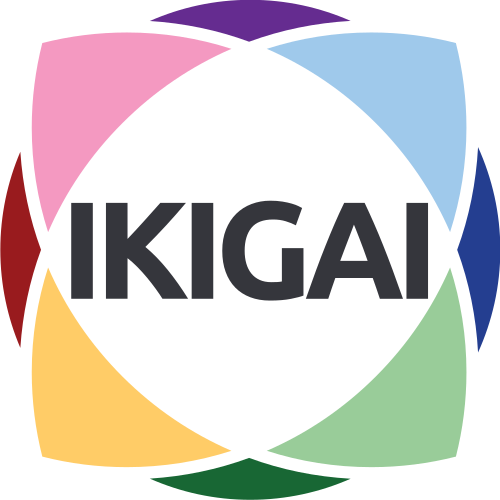

+++
title = "Blogeintrag vom 13. September"
date = "2022-09-13"
draft = false
pinned = false
image = "istockphoto-1156787653-612x612.jpg"
description = "In diesem Blog beschreibe ich die 4 WEB-Lektionen vom 13. September. Ich beschreibe was ich in diesen Lektionen gemacht habe. "
+++
Heute habe ich individuell einen IkIGAI Test durchgeführt. Es gab sehr viele Fragen, über mein Verhalten und wie ich in verschiedenen Situationen entscheiden würde, in 4 Runden zu beantworten. Ich hatte jeweils 4 Möglichkeiten zur Auswahl und musste entscheiden welche dieser Möglichkeiten am meisten zutrifft und welche am wenigsten. 

Außerdem habe ich mit Andri der ganzen Klasse unser Projekt vorgestellt und erfahren was die anderen als Projekt machen. Wir haben unser Projekt mithilfe des Canvas, welches wir in der letzten Lektion erstellt haben, präsentiert. 

Unser gemeinsame nächste Schritt ist es zu überlegen wie wir unser Produkt vermarkten. Dafür müssen wir eine Marketingstrategie entwickeln um zu schauen wie wir unser Produkt am besten unter die Leute bringen.

