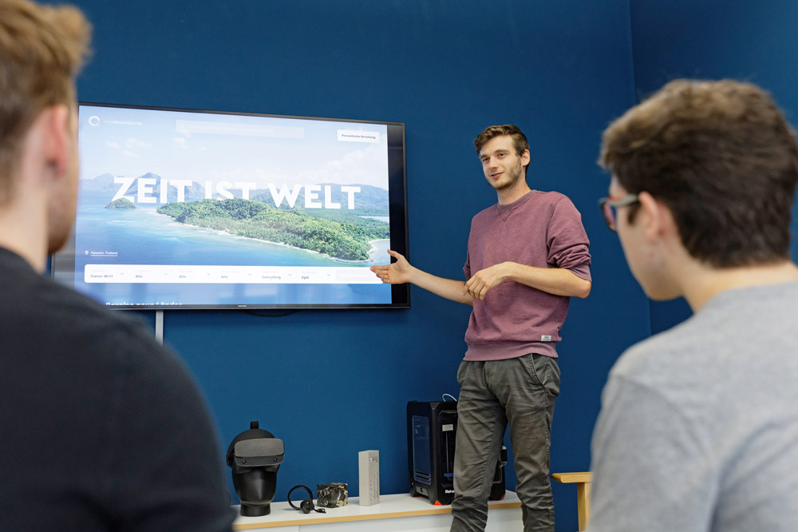

+++
title = "Unser Freund der Mediamatiker"
date = "2022-11-08"
draft = false
pinned = false
image = "getbb-1-.jpeg"
description = "In diesem Blogeintrag erfährt ihr was mir beim Treffen mit unserem Kollegen der Mediamatiker ist gelernt haben. "
+++
Für unser Projekt wollen wir an professionelle Informationen gelangen. Für an solche Informationen zu gelangen haben wir uns letzte Woche mit einem Kollegen getroffen, der eine Ausbildung zum Mediamatiker macht. Wir sind mit ihm in die Oberstufe gegangen und kennen ihn von dort. Er selbst hat ein kleines Business, wo er verschiedene Sachen designt und diese über Instagram vermarktet, also passend zu unserem Projekt. 

Wir haben uns bei ihm zuhause getroffen und über unser Projekt und über sein Business gesprochen. Er hat uns erklärt, wie er seine Sachen vermarktet, wie er mit Kunden umgeht und er hat uns über verschiedene Erfahrungen, die er gesammelt hat, berichtet. 

Wir hatten Probleme wie wir unser Projekt vermarkten sollen, aber er konnte uns weiterhelfen und wir haben mit ihm zusammen ein Marketingkonzept aufgestellt. 

In den heutigen Lektionen haben wir ein Standup gemacht und danach mit der ganzen Klasse am HTML-Projekt weitergearbeitet. 

Als nächstes wollen wir nochmal in der Stadt oder in Wabern potenzielle Kunden befragen gehen und ihnen schon eine angefangene Webseite zeigen, die wir zusammen mit unserem Kollegen gemacht haben. Aus solchen Gesprächen erhoffen wir uns Informationen auf was die Kunden bei einer Webseite von uns wertlegen und welche Dienstleistungen sie von uns erwarten. 

Dabei kann das Risiko entstehen, welches wir schon die letzten Male hatten, und zwar das die Leute nicht die Zeit aufwenden wollen, um mit uns über unser Projekt zu reden. Aber damit muss man umgehen und einfach warten, bis man eine Person gefunden hat die genügende Zeit zur Verfügung hat.