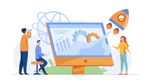
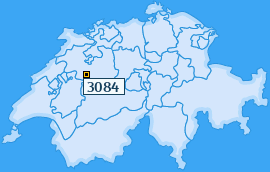

+++
title = "Unser Projekt"
date = "2022-08-30"
draft = false
pinned = false
image = "erstes_projekt.jpg"
description = "In diesem Blogbeitrag erfährt alle wichtigen Informationen über unser Projekt. "
+++

Wir haben uns dafür entschieden unseren Kunden ein Webdesign zu verkaufen. Unser Ziel ist es unseren Kunden nicht nur eine funktionstüchtige Webseite zu designen, sondern auch ein Design zu erstellen das optisch ansprechend und einzigartig ist. Wird es vom Kunden gewünscht, dann bieten wir auch Wartungsarbeiten für die Webseiten an. 

Wir haben "3084 Designs AG" als Firmennamen gewählt, weil dort unser Firmensitz ist. 

Der Vertrieb unserer Webseitendesigns planen wir über unsere eigene Webseite. Unsere Kundengruppe sind jene die entweder das Know-how nicht haben oder nicht interessiert sind ihre Webseite zu selbst zu designen.          Wir haben also ein sehr breites Kundensegment.  

Um unser Produkt ans Volk zu bringen, machen wir Werbung mittels Social Media da man von dort einfach und kostenlos an viele Menschen Informationen senden kann und mithilfe von Werbemails. Wir haben uns für die Kanäle Instagram, TikTok und Facebook entschieden, da diese im Moment am meisten von unseren verschiedenen Kunden verwendet werden. 

Diese Information und viele mehr haben wir mithilfe von Umfragen in der Stadt Bern und in Wabern erlangt. 

Unserer Meinung nach zeichnet uns aus, dass wir kreative und einzigartige Designs für unsere Kunden erstellen. Außerdem können wir unseren Kunden ein persönliches Kundenverhältnis anbieten. 

Dieses Geschäftsmodell eignet sich perfekt für unser Startup, weil wir keine Kosten haben, da alles von unserem Laptop aus gemacht wird. Die einzigen Kosten, die anfallen könnten sind die Lohnkosten.